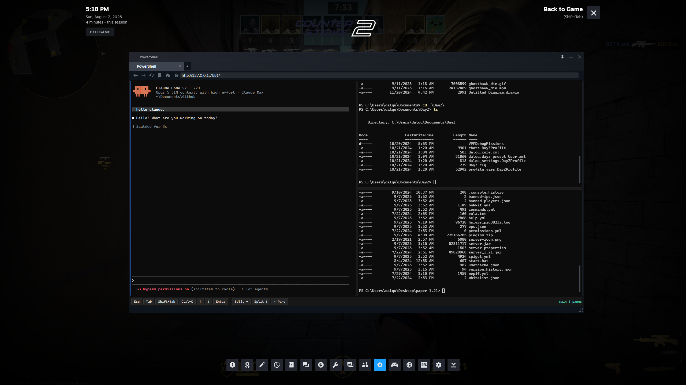

# steam-overlay-terminal — PowerShell in the Steam in-game overlay

Run PowerShell, and Claude Code (or any coding CLI) with it, inside the Steam overlay instead of alt-tabbing
out of your game. It's a real Windows ConPTY session served as a local web page, so
Shift+Tab gets you a shell rather than a browser you didn't want.

Built because I am often multitasking playing CS2 and programming. This makes it easier to interface with since its in your steam overlay. 



*Three panes and a live Claude Code session in the Steam overlay, mid-match in
Counter-Strike 2.*

- Real ConPTY session through `node-pty`, so full TUIs work. Claude Code, vim, fzf, all of it.
- The shell outlives the browser. Close the overlay, reload the page, or move to another
  device and you reattach to the same shell with its scrollback.
- Your normal terminal window can join the same session (`client.js`), which makes the
  overlay a second view of the shell you were already using.
- Split panes with the Windows Terminal bindings. Each pane is its own shell, and the
  layout survives a reload.
- A **Sessions** button that lists every shell the server has, including the ones no pane
  is currently showing, so you can reattach to any of them without remembering names.
- A clickable key bar for Esc, Tab, Shift+Tab, Ctrl+C, the arrows and a sticky Ctrl,
  because Steam eats Shift+Tab and phone keyboards have none of those keys.
- Built for a phone as well as the overlay: swipe to scroll inside a full-screen TUI,
  adjustable text size, and a key bar that stays above the on-screen keyboard.
  See [On a phone](#on-a-phone).
- Several clients can attach at once: overlay, desktop, phone.
- Loopback only unless you ask for otherwise, and it refuses connections from other web
  pages. See [Security](#security).

Requirements: Windows 10 1809 or newer, which is when ConPTY landed; Node.js 18+; and
PowerShell. It uses `pwsh.exe` if that's on your PATH and falls back to the built-in
`powershell.exe`.

## Quick start

**1. Install**

```powershell
git clone https://github.com/YOUR-USERNAME/steam-overlay-terminal.git
cd steam-overlay-terminal
npm install
```

**2. Start the server** and leave it running:

```powershell
npm start
```

It prints the URL, usually `http://127.0.0.1:7681/`.

**3. Point Steam at it.** Two settings, both one-time:

- OPTIONAL: Steam → Settings → In Game → Overlay shortcut keys. Move the overlay off Shift+Tab.
  Claude Code uses Shift+Tab to cycle permission modes, so the default binding is
  guaranteed to collide. Ctrl+Shift+O works.
- Steam → Settings → Web Browser → Web browser home page. Paste the URL from step 2, and
  the overlay opens straight into the terminal.

Check the game's Properties → General → *Enable the Steam Overlay while in-game* too.

**4. Use it.** Launch a game, hit your overlay key, and paste in the URL.
Closing the overlay doesn't kill anything, so reopening puts you back where you were.

## Split panes, like Windows Terminal

Same bindings as Windows Terminal:

| Action | Key | Button |
| --- | --- | --- |
| Split right | `Alt+Shift++` | **Split →** |
| Split down | `Alt+Shift+-` | **Split ↓** |
| Move focus | `Alt+←↑↓→` | click a pane |
| Close pane | `Ctrl+Shift+W` | **× Pane** |

Drag the divider between two panes to resize, and the pty resizes with it. Every pane is
an independent shell with its own session name, shown in the status corner.

The layout is saved to `localStorage`. Reload the page, or let the overlay reload it for
you, and the same panes come back attached to the same live shells. Closing a pane ends
that shell. Disconnecting never does.

If the overlay intercepts one of the key bindings, use the buttons. On a screen narrower
than 900px they live behind **⋯** in the bottom bar.

## Reopening a session

Shells outlive the browsers watching them, so after you quit a game there are usually live
sessions nothing is showing. **Sessions** in the bottom bar (under **⋯** on a phone)
lists all of them:

- Click a row to point the focused pane at that session.
- Click **+** to open it in a new pane instead, split along the pane's longer side.
- Type a name and press **Open** for a session that doesn't exist yet.

Sessions already on screen are marked, and picking one moves focus there rather than
showing the same shell twice — two panes of different sizes would otherwise fight over the
pty's dimensions. Moving a pane off a session only detaches from it. Only **× Pane**
(`Ctrl+Shift+W`) ends a shell.

The same list is what you want after a `server.js` restart of your own doing, or from a
phone that has never seen this machine's layout. It's a live view of the server, not of
your browser, so every client sees the same sessions.

One consequence of nothing being killed implicitly: split a pane and then send it to a
different session, and the shell that split spawned keeps running, listed as *detached*.
Attach a pane to it and close the pane to be rid of it.

## Share one shell between the overlay and Windows Terminal

Don't run `claude` in a separate PowerShell window. Run it inside the shared session, so
the overlay shows the work you were already doing:

```powershell
node client.js
```

That drops your current Windows Terminal window into the shared session with full 24-bit
color. It's a peer of the browser view rather than a mirror of it, so type in either one
and both see it. **Ctrl+]** detaches without killing the shell.

Already mid-conversation in an ordinary window? You don't have to move the window at all.
Claude Code sessions are portable: start `client.js`, or open the overlay, and run
`claude --continue` to pick the conversation back up.

> You can't adopt an already-running PowerShell window into a session. Windows has no way
> to re-parent a live process's stdio onto a new pty.

## From your phone or tablet, over your LAN

Often nicer than typing into a game overlay:

```powershell
node server.js --lan
```

The server also listens on your LAN IP and prints a URL like
`http://192.168.1.42:7681/?t=<token>`. Open that on any device on your network.

The token is generated once and saved to `.token` (gitignored), so the URL stays stable and
works as a bookmark. **Anyone on your network with that token gets a shell on this machine.
Don't port-forward it.**

## On a phone

The page is the same page, but a phone is not a desktop, so:

**Swipe to scroll, even inside Claude Code.** A full-screen TUI takes over the alternate
screen and asks the terminal to report the mouse, and in that state xterm.js ignores touch
entirely — a mouse wheel works and a finger does nothing. Swipes are translated into wheel
events instead, which each app then gets in whatever form it asked for: a mouse report to
something tracking the mouse, arrow keys on the alternate screen, a scrollback scroll in a
plain shell. One line of text per line of finger travel, both directions.

**Text size.** **A−** and **A+** change it live for every pane and remember the choice per
device, so the phone can sit at 11px while the desktop stays at 14px. Small screens start
at 11px for that reason: columns are what a TUI needs, and the desktop default leaves a
portrait phone about 43 of them.

**The key bar.** The keys scroll sideways; everything else stays pinned. Below 900px wide
the pane and session controls collapse into **⋯** so the keys keep the room. **Ctrl** is
sticky: tap it, then type a letter, and it is sent as that control code — `Ctrl` then `d`
is `Ctrl+D`. Tapping any bar button leaves the terminal focused, so the keyboard stays up.

**The on-screen keyboard** shortens the page instead of covering the bar, and **Keyboard**
in the **⋯** menu summons and dismisses it. Note that the keyboard costs you rows, and the
pty is shared, so opening it reflows the shell for every other client attached to that
session too.

**Gestures that used to lose your session** are gone: no pull-to-refresh, no double-tap
zoom over a pane. Pane dividers have a fat invisible touch target, and the safe area around
a notch or home indicator is respected.

## Security

This thing hands out shells, so here's exactly what's protecting yours.

- Without `--lan` the server binds `127.0.0.1`, and nothing off this machine can reach it.
- Other web pages can't use it. A WebSocket handshake is exempt from the same-origin
  policy, so any site you had open in a tab could otherwise connect to
  `ws://127.0.0.1:7681/ws` and start typing into your shell. The server rejects any
  handshake whose `Origin` isn't the page it served itself. Non-browser clients like
  `client.js` send no `Origin` at all, which is how they get told apart.
- DNS rebinding is blocked too. With no token in play, requests have to arrive addressed
  to a loopback name, and a rebinding page always shows up under its own hostname. If you
  reach the server by some other name, add it with `--allow-host`.
- `--lan` requires a token, compared in constant time. It's the only thing standing between
  your LAN and a shell, and it travels in the URL over plain HTTP. Keep it on the LAN: no
  port forwarding, no public tunnel.
- Nothing is sandboxed. The shell runs as you, with your profile and your privileges.
  That's the whole point of the tool, but it does mean the trust boundary is the machine.

Found something? Open an issue. Please don't paste your `.token` into it.

## Options

```powershell
node server.js --port 7681          # change port (default 7681)
node server.js --lan                # listen on LAN too; requires a token
node server.js --cwd C:\src\myrepo  # shell start directory
node server.js --shell powershell.exe   # default: pwsh.exe if on PATH, else powershell.exe
node server.js --token <str>        # set the LAN token instead of the generated one
node server.js --allow-host term.local  # extra hostname the browser may use (repeatable)

node client.js --host 127.0.0.1     # server address (default 127.0.0.1)
node client.js --port 7681          # match a non-default server port
node client.js --session build      # a second, independent shell
node client.js --token <tok>        # needed when the server runs with --lan
```

Web URL parameters:

| Param | Meaning |
| --- | --- |
| `?s=<name>` | open a named session, matching `client.js --session <name>` |
| `?fontSize=<n>` | terminal font size, overriding the remembered one (default 14, or 11 on a small screen) |
| `?t=<token>` | required when the server runs with `--lan` |

## Troubleshooting: the overlay browser won't load the page

`http://127.0.0.1:7681/` does load in the overlay browser. The screenshot above is it. If
yours won't, the overlay ships an older Chromium build and some people report loopback
addresses failing in it. Cheapest fixes first:

1. Use `http://127.0.0.1:7681/`, not `http://localhost:7681/`.
2. Run with `--lan` and use the LAN IP it prints. A routable address skips loopback
   handling entirely.
3. Add `127.0.0.1  term.local` to `C:\Windows\System32\drivers\etc\hosts`, start the server
   with `--allow-host term.local`, and browse to `http://term.local:7681/`.

## Notes and limitations

- Tested in Counter-Strike 2, which is what the screenshot shows. Any game with the Steam
  overlay enabled should behave the same.
- Exclusive-fullscreen games work. That's the main thing you get over an always-on-top
  terminal window, which exclusive fullscreen just hides.
- Some games grab the mouse hard. The overlay usually still takes focus, but
  borderless-windowed mode is more reliable.
- The shell inherits your PowerShell profile, so a slow or noisy profile shows up here too.
  Use `--shell` or fix the profile.
- Sessions live in server memory. Restarting `server.js` ends them.
- Scrollback replay is capped at 512 KB per session.
- Windows only. The pty layer is ConPTY, and the point is the Windows shell you already use.

## How it works: ConPTY, node-pty, and xterm.js

`server.js` spawns PowerShell in a ConPTY through `node-pty` and keeps it running whether
or not anyone is watching. Browsers connect over a WebSocket to an xterm.js page.
`client.js` connects to that same WebSocket and pipes it through your terminal's stdio in
raw mode. Output is fanned out to every attached client and buffered for replay, so
attaching and detaching loses nothing.

`GET /sessions` returns the live session list as JSON, which is what the **Sessions**
button reads. It is read-only on purpose: ending a shell still happens only over a
WebSocket already attached to it, which keeps this server's mutating surface at one place.

The replay frame is flagged as a replay, because it still contains whatever the shell
asked the terminal when it started — “what are you?”, at least. A client that answered
those a second time would be typing the answer into whatever is running in the shell now,
which is why attaching used to leave `[?1;2c` at your prompt. Clients stay mute until the
replay is parsed.

## License

MIT, see [LICENSE](LICENSE). Not affiliated with Valve or Anthropic.
